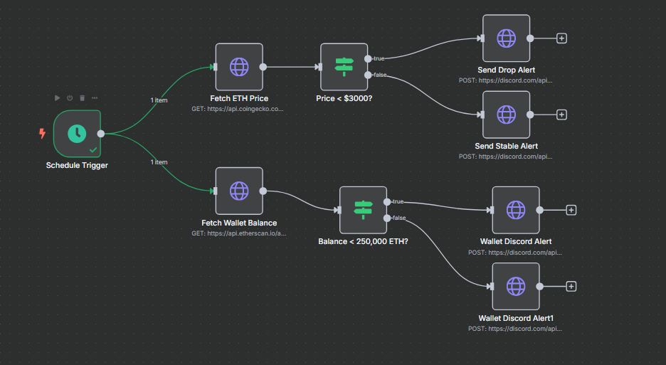
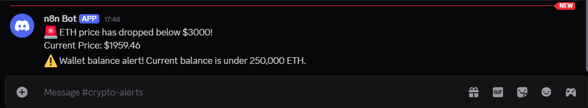

# 🔔 n8n Crypto Alert Bot

This project is a real-time crypto monitoring automation using **n8n**, integrating:
- 🧠 [CoinGecko API](https://www.coingecko.com/en/api/documentation): for live ETH/BTC price tracking
- 💼 [Etherscan API](https://docs.etherscan.io/): for Ethereum wallet activity monitoring
- 🧾 Discord Webhooks: to send instant alerts when predefined triggers are hit

---

## 🛠️ Features

- Monitor ETH price and alert on Discord when it drops below a threshold
- Track wallet balance (say Vitalik's) or transaction changes (via Etherscan)
- Fully automated using n8n's visual workflow builder
- Modular and easily customizable

---

## 📦 Tech Stack

- **n8n** (self-hosted or cloud)
- **CoinGecko API** (No API key needed!)
- **Etherscan API** (Free tier)
- **Discord Webhook** (for alert delivery)

---

## 📸 Workflow Preview

> 

---

## 🚀 How to Use

1. Clone this repo  
2. Import `workflow.json` into your n8n instance  
3. Set your environment variables (API keys, thresholds)  
4. Test the trigger and receive alerts on your Discord server  

---
## Discord Messages Preview
> 
---

## 🧠 Why This Matters

Crypto markets move fast. This automation gives you real-time insight without needing to constantly monitor prices or wallet changes — all without writing code.

---

## 💬 Contact

**Yash Upadhyay**  
[LinkedIn](https://www.linkedin.com/in/yashupadhyay-yashord) | [GitHub](https://github.com/yashordK)
